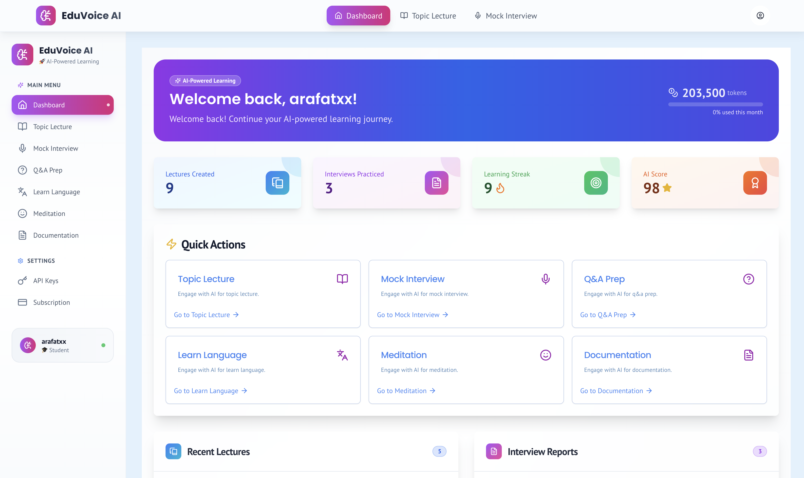
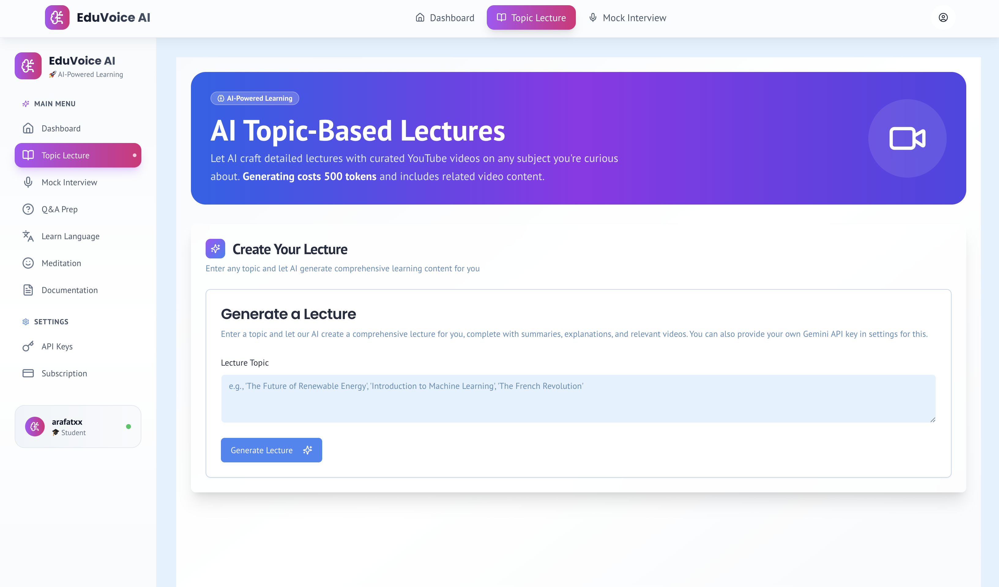
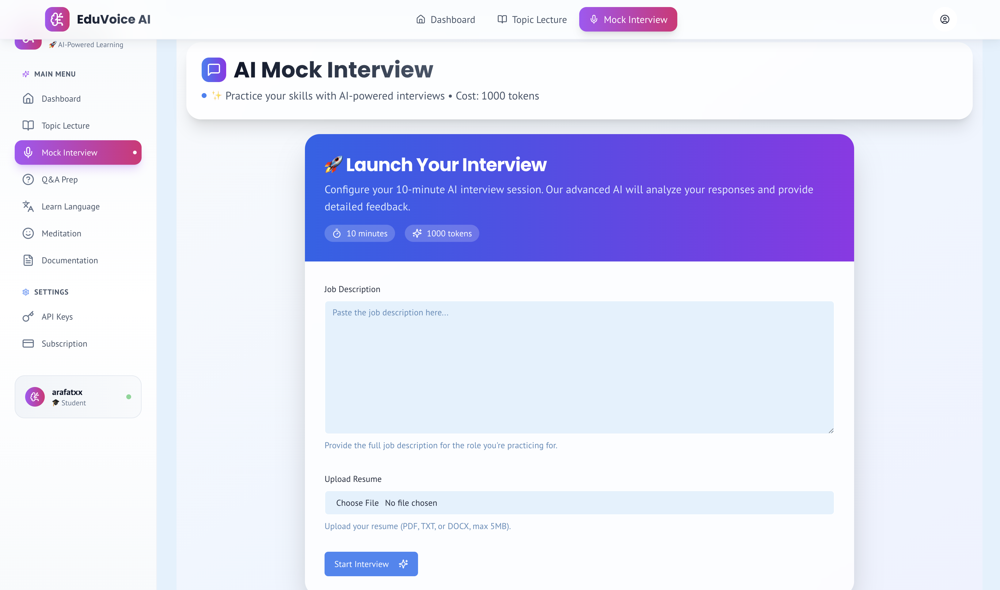
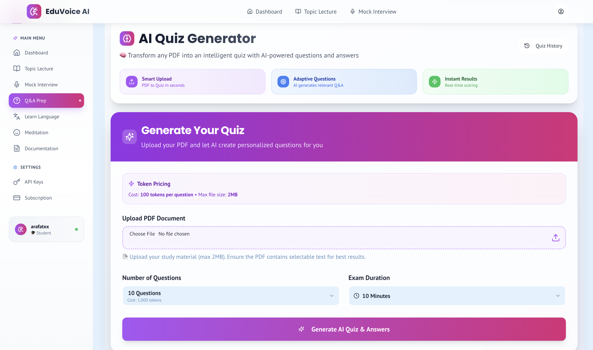
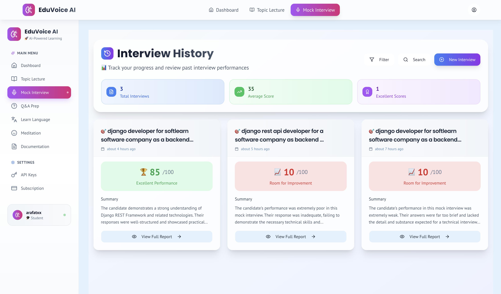
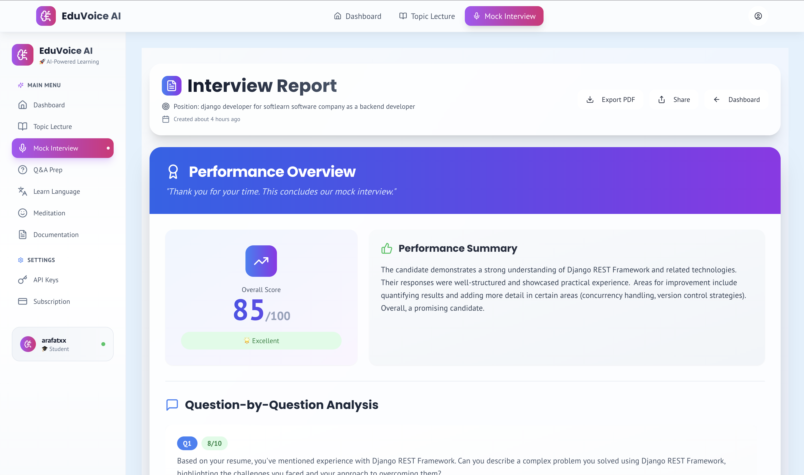
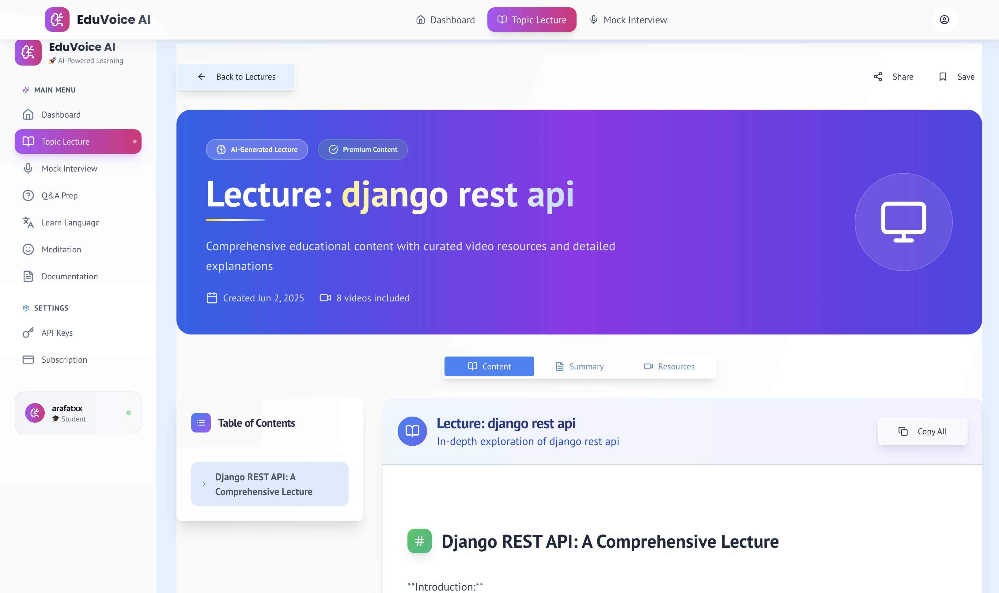
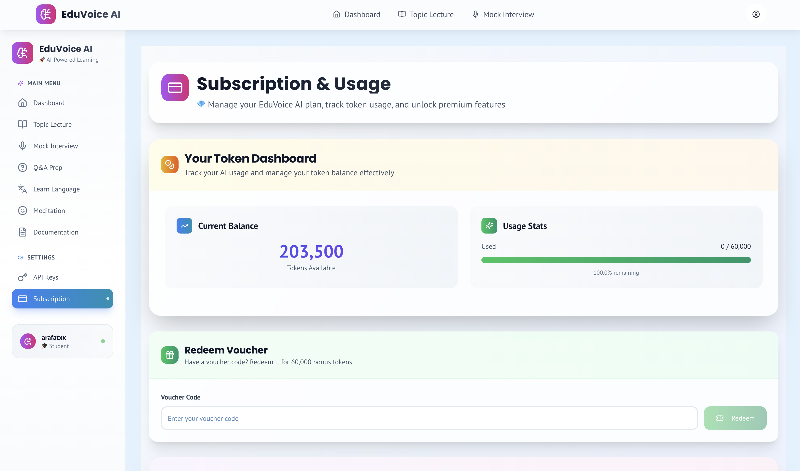
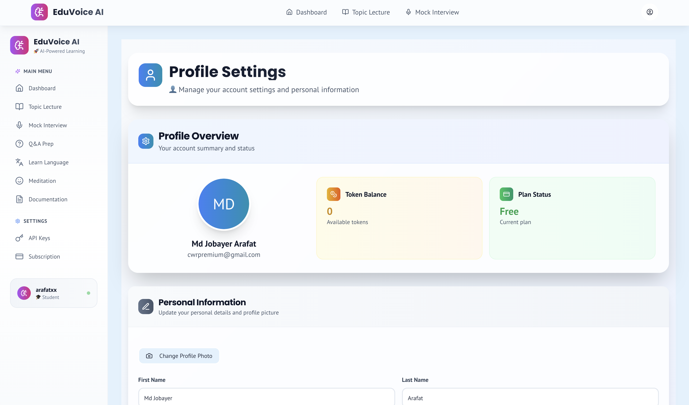

# EduVoice AI - AI-Powered Educational Platform

🚀 **An advanced educational platform powered by AI that provides comprehensive learning experiences through lectures, mock interviews, quizzes, and language assessments.**

## 🌟 Features
## 🖥️ Screenshots

<div align="center">

### Dashboard Overview


### AI Lecture Generation


### Voice Interview Practice


### Smart Q&A Sessions


### Interview History


### Performance Reports


### Lecture Details


### Subscription Management


### User Profile

</div>
### 🎓 AI Lecture Generation
- Generate comprehensive lectures on any topic
- AI-curated YouTube video integration
- Interactive content with summaries and explanations
- **Token Cost:** 500 tokens per lecture

### 🎤 AI Mock Interview
- Voice-based AI interview practice
- Personalized questions based on uploaded CVs
- Real-time feedback and scoring
- ElevenLabs voice AI integration for natural conversations
- **Token Cost:** 1,000 tokens per session

### 📝 AI Quiz Generator
- Generate custom quizzes from PDF materials
- 5 different quiz methods:
  - Multiple Choice Questions
  - True/False Questions
  - Fill-in-the-blank
  - Short Answer Questions
  - Essay Questions
- Timed exam simulation with detailed scoring
- **Token Cost:** 5 tokens per question

### 🌍 Language Assessment Hub
- Comprehensive language testing with video assessments
- Support for 13+ languages (English, Spanish, French, German, Italian, Portuguese, Russian, Chinese, Japanese, Korean, Arabic, Hindi, Dutch)
- Tavus AI video integration for conversational assessments
- CEFR-based scoring and detailed feedback
- **Token Cost:** 10,000 tokens per assessment

## 🛠️ Tech Stack

### Frontend
- **Next.js 15** - React framework for production
- **TypeScript** - Type-safe development
- **Tailwind CSS** - Utility-first CSS framework
- **Shadcn/ui** - Modern UI components
- **Radix UI** - Accessible component primitives
- **Lucide React** - Beautiful icons

### Backend & Database
- **Appwrite** - Backend-as-a-Service platform
  - Authentication & user management
  - Database for storing user data, reports, and sessions
  - File storage for PDFs, audio, and profile images
  - Real-time subscriptions

### AI & Machine Learning
- **Google Gemini** (Default AI model)
  - Gemini 2.0 Flash for content generation
  - Gemini 1.5 Flash for evaluations
  - Support for user-provided API keys
- **OpenAI** (Optional) - User can provide their own API key
- **Anthropic Claude** (Optional) - User can provide their own API key
- **Google Genkit** - AI framework for building AI-powered applications

### Voice & Video AI
- **ElevenLabs** - Text-to-speech and voice AI for mock interviews
  - Natural voice synthesis
  - Multiple voice options
  - Real-time audio generation
- **Tavus AI** - Video AI for language assessments
  - Conversational Video Interface (CVI)
  - Real-time multimodal video conversations
  - AI avatar interactions

### Additional Technologies
- **React Hook Form** - Form management
- **Zod** - Schema validation
- **React Query** - Data fetching and caching
- **React Markdown** - Markdown rendering
- **Recharts** - Data visualization
- **Speech Recognition API** - Browser speech-to-text

## 🚀 Getting Started

### Prerequisites
- Node.js 18+ and npm/yarn
- Appwrite instance (cloud or self-hosted)
- Google Gemini API key
- ElevenLabs API key (for voice features)
- Tavus API key (for language video tests)

### Installation

1. **Clone the repository**
   ```bash
   git clone https://github.com/yourusername/eduvoiceai-trae.git
   cd eduvoiceai-trae
   ```

2. **Install dependencies**
   ```bash
   npm install
   ```

3. **Environment Setup**
   Create a `.env.local` file in the root directory:
   ```env
   # Appwrite Configuration
   NEXT_PUBLIC_APPWRITE_ENDPOINT=https://your-appwrite-endpoint
   NEXT_PUBLIC_APPWRITE_PROJECT_ID=your-project-id
   APPWRITE_API_KEY=your-api-key
   NEXT_PUBLIC_APPWRITE_DATABASE_ID=your-database-id
   NEXT_PUBLIC_APPWRITE_USERS_COLLECTION_ID=users
   NEXT_PUBLIC_APPWRITE_LECTURES_COLLECTION_ID=lectures
   NEXT_PUBLIC_APPWRITE_INTERVIEWS_COLLECTION_ID=interviews
   NEXT_PUBLIC_APPWRITE_QA_REPORTS_COLLECTION_ID=qa_reports
   NEXT_PUBLIC_APPWRITE_VOUCHERS_COLLECTION_ID=vouchers
   NEXT_PUBLIC_APPWRITE_TRANSACTIONS_COLLECTION_ID=transactions
   NEXT_PUBLIC_APPWRITE_LANGUAGE_TESTS_COLLECTION_ID=language_tests
   NEXT_PUBLIC_APPWRITE_PROFILE_IMAGES_BUCKET_ID=profile_images
   NEXT_PUBLIC_APPWRITE_AUDIO_BUCKET_ID=audio

   # AI API Keys
   GEMINI_API_KEY=your-gemini-api-key
   
   # Voice AI
   ELEVENLABS_API_KEY=your-elevenlabs-api-key
   
   # Video AI
   TAVUS_API_KEY=your-tavus-api-key
   ```

4. **Run the development server**
   ```bash
   npm run dev
   ```

5. **Start Genkit development server** (for AI flows)
   ```bash
   npm run genkit:dev
   ```

6. **Open your browser**
   Navigate to `http://localhost:9002`

## 🔧 Configuration

### Appwrite Setup
1. Create an Appwrite project
2. Set up the required collections with proper schemas
3. Configure authentication providers
4. Set up storage buckets for file uploads

### AI API Keys
Users can provide their own API keys for:
- **Google Gemini** - For content generation and evaluations
- **OpenAI** - Alternative AI model option
- **Anthropic Claude** - Alternative AI model option

The platform falls back to default keys when user keys are not provided.

### Voice & Video Configuration
- **ElevenLabs**: Configure voice models and settings for interview practice
- **Tavus AI**: Set up replicas and personas for language video assessments

## 📊 Token System

The platform uses a token-based pricing system:

### Free Plan
- **60,000 free tokens** for new users
- Access to all features

### Premium Plan
- Unlimited tokens
- Priority support
- Advanced features

### Token Costs
- AI Lecture Generation: 500 tokens
- AI Mock Interview: 1,000 tokens
- AI Quiz Generator: 5 tokens per question
- Language Assessment: 10,000 tokens

## 🏗️ Project Structure

```
src/
├── ai/                     # AI flows and configurations
│   ├── flows/              # Genkit AI flows
│   ├── genkit.ts          # Genkit configuration
│   └── dev.ts             # Development setup
├── app/                    # Next.js app directory
│   ├── (app)/             # Main application routes
│   ├── (admin)/           # Admin panel routes
│   ├── api/               # API routes
│   └── marketing/         # Landing page
├── components/             # React components
│   ├── ui/                # Shadcn UI components
│   ├── auth/              # Authentication components
│   ├── interviews/        # Interview-related components
│   ├── language/          # Language test components
│   └── layout/            # Layout components
├── lib/                    # Utility libraries
│   ├── appwrite.ts        # Appwrite client configuration
│   ├── elevenlabs.ts      # ElevenLabs integration
│   ├── tavus.ts           # Tavus AI integration
│   └── utils.ts           # General utilities
└── types/                  # TypeScript type definitions
```

## 🔌 API Integration

### ElevenLabs Integration
- Text-to-speech conversion for interview questions
- Voice selection and customization
- Real-time audio streaming

### Tavus AI Integration
- Conversational Video Interface (CVI) for language tests
- AI avatar creation and management
- Real-time video conversations

### Appwrite Integration
- User authentication and management
- Database operations for all collections
- File storage and retrieval
- Real-time data synchronization

## 🚀 Deployment

### Vercel (Recommended)
1. Connect your GitHub repository to Vercel
2. Configure environment variables
3. Deploy automatically on push

### Docker
```bash
# Build the image
docker build -t eduvoiceai .

# Run the container
docker run -p 3000:3000 eduvoiceai
```

## 🤝 Contributing

1. Fork the repository
2. Create a feature branch (`git checkout -b feature/amazing-feature`)
3. Commit your changes (`git commit -m 'Add amazing feature'`)
4. Push to the branch (`git push origin feature/amazing-feature`)
5. Open a Pull Request

## 📝 License

This project is licensed under the MIT License - see the [LICENSE](LICENSE) file for details.

## 🆘 Support

For support, email support@eduvoiceai.com or join our Discord community.

## 🙏 Acknowledgments

- **Google Gemini** for powerful AI capabilities
- **ElevenLabs** for natural voice synthesis
- **Tavus AI** for conversational video technology
- **Appwrite** for robust backend services
- **Next.js** team for the amazing framework
- **Shadcn** for beautiful UI components

---

**Built with ❤️ by the EduVoice AI Team**
